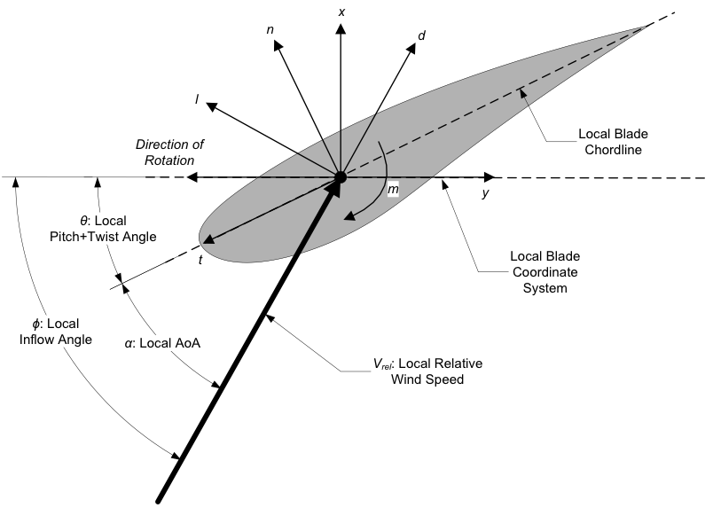

.. _hd_appendix:

Appendix
========

.. _hd_input_files:

HydroDyn Input Files
-------------------

In this appendix we describe the HydroDyn input-file structure and provide examples.

1) HydroDyn Driver Input File 
:download:`(driver input file example) <examples/hd_driver_example.inp>`: 

The driver input file is only needed for the standalone version of HydroDyn and contains inputs normally generated by OpenFAST, and necessary to control the aerodynamic simulation for uncoupled models.  

2) HydroDyn Primary Input File 
:download:`(primary input file example) <examples/hd_primary_example.inp>`: 

The primary HydroDyn input file defines modeling options, environmental conditions (except freestream flow), airfoils, tower nodal discretization and properties, as well as output file specifications.

The file is organized into several functional sections.  Each section corresponds to an aspect of the aerodynamics model.  

The input file begins with two lines of header information which is for your use, but is not used by the software.

.. _hd_output_channels:

HydroDyn List of Output Channels
-------------------------------

This is a list of all possible output parameters for the HydroDyn module.  
The names are grouped by meaning, but can be ordered in the OUTPUTS section of the HydroDyn 
input file as you see fit.  ``BαNβ``, refers to output node β of blade α, where α is a number 
in the range [1,3] and β is a number in the range [1,9], corresponding to entry β in the ``BlOutNd`` list.  
``TwNβ`` refers to output node β of the tower and is in the range [1,9], corresponding to entry β in the ``TwOutNd`` list.

The local tower coordinate system is shown in :numref:`ad_tower_geom` and the local blade coordinate system is shown in :numref:`ad_blade_local_cs` below.  Figure :numref:`ad_blade_local_cs` also shows the direction of the local angles and force components.

.. _ad_blade_local_cs:

   HydroDyn Local Blade Coordinate System (Looking Toward the Tip, 
   from the Root) – l: Lift, d: Drag, m: Pitching, x: Normal (to Plane), 
   y: Tangential (to Plane), n: Normal (to Chord), 
   and t: Tangential (to Chord)

.. _hd-output-channel:

.. figure:: figs/hd_output_channel.pdf
   :width: 500px
   :align: center

   HydroDyn Output Channel List
