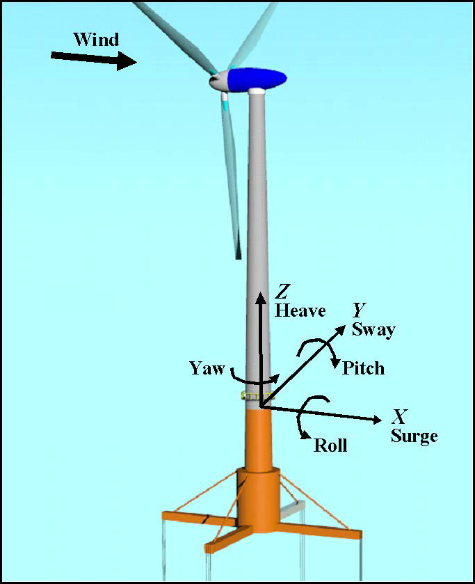

.. _hd_theory:

HydroDyn Theory
================
This is a preliminary draft of the HydroDyn theory and should be considered a work in progress.

Hydrodynamics are modeled using a suitable combination of incident-wave kinematics and hydrodynamic 
loading models. Hydrodynamic loads result from the integration of the dynamic pressure of the water 
over the wetted surface of a floating platform. These loads include contributions from inertia 
(added mass) and linear drag (radiation), buoyancy (restoring), incident-wave scattering 
(diffraction), sea current, and nonlinear effects.

Coordinate Systems
--------------------
   
Global coordinate system: :math:`(X,Y,Z)`
^^^^^^^^^^^^^^^^^^^^^^^^^
   
:numref:`hd-frame` shows the coordinate system used in HydroDyn.

.. _hd-frame:

   Global (internal) coordinate system in HydroDyn (and OpenFAST).
   
* The global axes are represented by the unit vectors :math:`\hat{I}`, :math:`\hat{J}`, and :math:`\hat{K}`.
* The origin is set at the mean sea level (MSL), the center of the structure, with :math:`Z` axis positive upward.
* The positive :math:`X` axis is along the nominal (zero-degree) wave propagation direction.
* The :math:`Y` axis can be found assuming a right-handed Cartesian coordinate system.

Structural member local coordinate system: :math:`(x,y,z)`
^^^^^^^^^^^^^^^^^^^^^^^^^^^^^^^^^^^^
* Axes are represented by the unit vectors :math:`\hat{i}`, :math:`\hat{j}`, and :math:`\hat{k}`.
* The origin is set at the center of the structural member.
* The local :math:`z` axis is along the cylinder axis, directed from the start joint to the end joint. The start joint is defined as the joint that has a lower :math:`Z` coordinate value. If the two joints have the same :math:`Z` coordinate value, then the one that has the lower :math:`X` coordinate value is the start point. If the two joints have the same :math:`Z` and :math:`X` coordinate value, then the one that has the lower :math:`Y` coordinate value is the start point.
* The local :math:`x` axis is parallel to the global :math:`XZ` plane, positive along the nominal wave propagation direction. If the cylinder’s axis is along the global :math:`X` direction, then the local :math:`x` axis is parallel to the :math:`XZ` plane, and positive along the negative global :math:`Z` direction.
* The local :math:`y` axis can be found assuming a right-handed Cartesian coordinate system.

Local to Global transformation
^^^^^^^^^^^^^^^^^^^^^^^^^^^^^^^
For regular members, the cylinder expression in global coordinate system can be found as follows:

.. math::

      \begin{Bmatrix} X \\ Y \\ Z \\ \end{Bmatrix} = \begin{bmatrix} C \end{bmatrix} \begin{Bmatrix} r \cos(\theta) \\ r \sin(\theta) \\ z \\ \end{Bmatrix} + \begin{Bmatrix} \frac{X_s+X_e}{2} \\ \frac{Y_s+Y_e}{2} \\ \frac{Z_s+Z_e}{2} \\ \end{Bmatrix}      

where :math:`(X_s,Y_s,Z_s)` and :math:`(X_e,Y_e,Z_e)` are the start and end joints of the member in global coordinate system 
of the member, and :math:`\begin{bmatrix} C \end{bmatrix}` is the direction cosine matrix of the member axis and can be obtained as follows:

.. math::

      \begin{bmatrix} C \end{bmatrix} = 
   	\begin{bmatrix}
		\frac{Z_e-Z_s}{L_{XZ}} & \frac{(X_e-X_s)(Y_e-Y_s)}{L_{XZ}L} & \frac{(X_e-X_s)}{L} \\
		0 & \frac{L_{XZ}}{L} & \frac{Y_e-Y_s}{L} \\
		\frac{-X_e+X_s}{L_{XZ}} & -\frac{(Z_e-Z_s)(Y_e-Y_s)}{L_{XZ}L} & \frac{(Z_e-Z_s)}{L} \\
		\end{bmatrix}
      
where :math:`L_{XZ} = \sqrt{(X_e-X_s)^2 + (Z_e-Z_s)^2}` and :math:`L = \sqrt{(X_e-X_s)^2 + (Y_e-Y_s)^2 + (Z_e-Z_s)^2}`.

When :math:`X_e=X_s` and :math:`Z_e=Z_s` then the :math:`\begin{bmatrix} C \end{bmatrix}` matrix can be found as follows:

if :math:`Y_e < Y_s` then

.. math::

      \begin{bmatrix} C \end{bmatrix} =
      \begin{bmatrix}
      1 & 0 & 0 \\
      0 & 0 & -1 \\
      0 & 1 & 0 \\
      \end{bmatrix}
      
else

.. math::

      \begin{bmatrix} C \end{bmatrix} =
      \begin{bmatrix}
      1 & 0 & 0 \\
      0 & 0 & 1 \\
      0 & -1 & 0 \\
      \end{bmatrix}
      
      
Wave Kinematics
---------------------
The wave kinematics are modeled using Airy wave theory, which can be used to describe either 
regular or irregular waves. For regular waves, the wave elevation (:math:`\zeta`) is represented as a 
sinusoid with a single amplitude (wave height) and frequency. Airy wave theory also describes 
how the undisturbed fluid-particle velocities and accelerations decay exponentially with depth. 
Irregular or random waves can then be represented as a summation or superposition of multiple 
wave components, as described by an appropriate wave spectrum:

:math:`\zeta(t) = \frac{1}{2\pi} \int_{-\infty}^\infty W(\omega) \sqrt{2\pi S_{\zeta}^{2-sided} (\omega) } \mathrm{e}^{j \omega t}\,\mathrm{d}\omega`

This equation represents the wave elevation as an inverse Fourier transform of the desired 
two-sided power spectral density, :math:`S_{\zeta}^{2-sided}` where, :math:`j` is an imaginary number and :math:`\omega` is an 
individual wave frequency. :math:`W(\omega)` is the Fourier transform of a realization of a white Gaussian 
noise (WGN) time-series process with zero mean and unit variance (i.e., the so-called “standard 
normal distribution”). This realization is used to ensure that the individual wave components 
have a random phase and that the instantaneous wave elevation is normally- (i.e., Gaussian-) 
distributed with zero mean and with a variance, on average, equal to :math:`\sigma_{\zeta}^2 = \int_{-\infty}^\infty S_{\zeta}^{2-sided}\,\mathrm{d}\omega`.

Further details about the wave kinematics and how they are computed can be found in [Jonkman, 2007].

Current Model
---------------
The current model within HydroDyn is a superposition of three different types of sub-models. 
These sub-models follow the forms defined in the IEC 61400-3 offshore wind standard [IEC, 2009].

The first is a sub-surface current model for currents that are generated by tides, 
storm surge, atmospheric pressure variations, etc. This model is characterized by a 
simple 1/7 power law over the water depth, d.

:math:`U_{SS}(Z)=U_{0_{SS}}(\frac{Z+d}{d})^{\frac{1}{7}}`

The second is near-surface currents generated by wind. This model is characterized by a linear 
distribution of the velocity with water depth, ending at zero at a prescribed depth, :math:`h_{ref}` (in [IEC, 2009], :math:`h_{ref}` is set at 20 m).

:math:`U_{NS}(Z)=U_{0_{NS}}(\frac{Z+h_{ref}}{h_{ref}}), Z \in [-h_{ref},0]`

The third model is a depth-independent model, which sets the current velocity to a constant value across the water depth.

You can specify a unique heading direction for each of the three current models.

Potential Flow Theory
----------------------
Three main approaches exist for modeling the hydrodynamic loads within HydroDyn, 
potential-flow theory, strip theory (via Morison’s equation), or a combination. 
This section reviews the forces modeled in HydroDyn when using a linear potential 
flow theory approach.

Modeling Approach
^^^^^^^^^^^^^^^^^^^^^
In linear potential-flow theory, the forces and added mass are applied at the platform reference point. The components are:

:math:`\overrightarrow{F}_{WRP} = \overrightarrow{F}_{W} + \overrightarrow{F}_{HS} + \overrightarrow{F}_{RD_n} + \overrightarrow{F}_{AM}`

where,

:math:`\overrightarrow{F}_{AM} = -AM_{RP}\overrightarrow{a}_P`

:math:`\overrightarrow{F}_{W} = \frac{1}{N}\displaystyle\sum_{k=-\frac{N}{2}-1}^{\frac{N}{2}} W[k]\sqrt{\frac{2\pi}{\Delta t} S_{\zeta}^{2-sided} (\omega) } X(\omega,\beta)|_{\omega=k\Delta\omega}\mathrm{e}^{j\frac{2\pi kn}{N}}`

:math:`\overrightarrow{F}_{HS} = \rho g V_0 (\{\zeta\}_3 + y^{CB}\{\zeta\}_4 - x^{CB}\{\zeta\}_5) - C^{Hydrostatic}x`

The general form of the convolution integral is:

:math:`\overrightarrow{F}_{RD} = -\int_0^t K(t-\tau) \bullet \dot{x}(\tau)\mathrm{d}\tau`

But we discretize this and only consider a specific amount of time history, :math:`N_{RD}`:

:math:`\overrightarrow{F}_{RD_n} = -\Delta t_{RD} \displaystyle\sum_{i=n-N_{RD}}^{n-1} K_{n-i-1}\dot{x_i}`

The state for time step :math:`n` is simply the structural velocities for the previous :math:`N_{RD}` time steps. Or,

:math:`x_{n}^d = \begin{Bmatrix} \dot{x_{n-1}} \\ \dot{x_{n-2}} \\ \vdots \\ \dot{x_{n-N_{RD}}} \end{Bmatrix}`

Therefore, at time step :math:`n`, we can compute the :math:`n+1` state, such that,

:math:`x_{n+1}^d = \begin{Bmatrix} \dot{x_n} \\ \dot{x_{n-1}}  \\ \vdots \\ \dot{x_{n-N_{RD}+1}} \end{Bmatrix}`

The radiation step size, :math:`\Delta t_{RD}`, and the radiation kernel, :math:`K`, are simply module parameters.

Morison's Equation
---------------------
Morison's equation is applicable for calculating the hydrodynamic loads on cylindrical 
structures when (1) the effects of diffraction are negligible, (2), radiation damping is 
negligible, and (3) flow separation may occur. The relative form of Morison's equation 
accounts for wave loading from incident-wave-induced excitation, radiation-induced added 
mass, and flow-separation-induced viscous drag. In this section we review the representation 
of Morison's equation both when considering distributed forces along the length of the 
members (at nodes) and point loads at the ends (at the joints).

Modeling Approach
^^^^^^^^^^^^^^^^^^^^
In HydroDyn, Morison forces are applied base on three possible wave stretching models. 

1) No wave stretching: forces applied only along the portion of the member below the MSL.
2) Vertical wave stretching: wave kinematics at the MSL are applied up to the instantaneous free surface, and left unchanged below the MSL.
3) Extrapolation stretching: a linear Taylor expansion of the wave kinematics (and their partial derivatives with respect to z) at the MSL is applied to find the wave kinematics above the MSL and up to the instantaneous free surface, and left unchanged below the MSL.

Forces are applied at the original position of the structure, and not at the instantaneous position.

Distributed Loads
For a Morison-only model, the distributed hydrodynamic loads applied along the length of a member are computed as:

